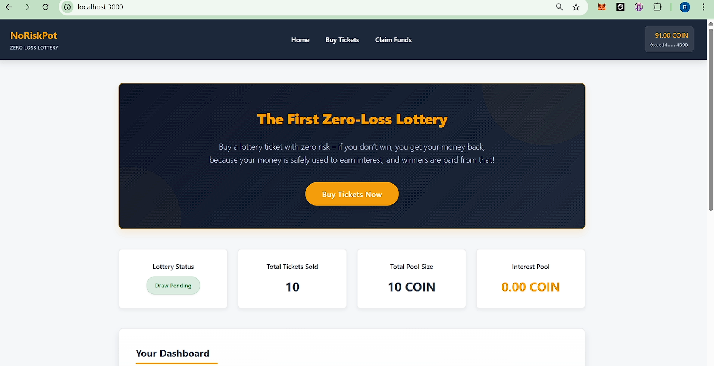
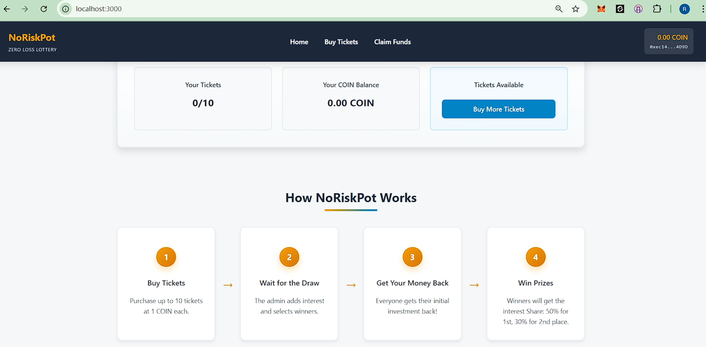
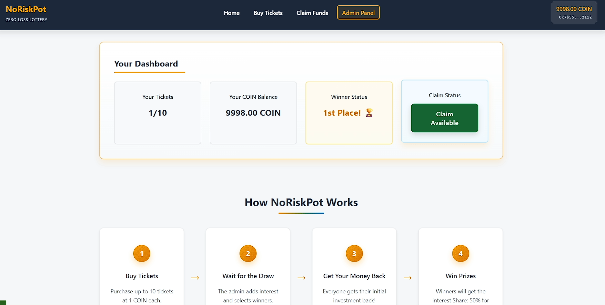
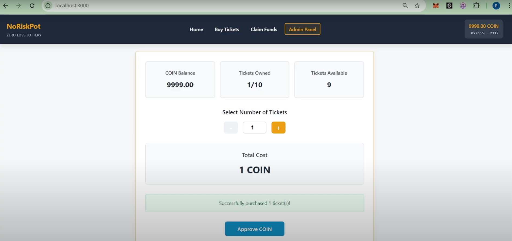
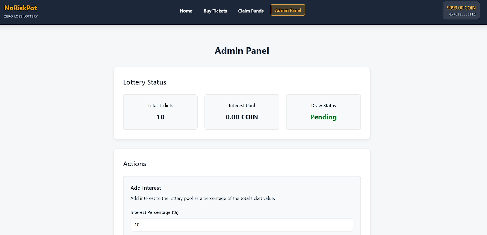
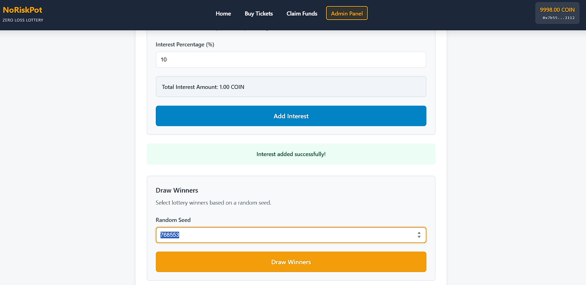
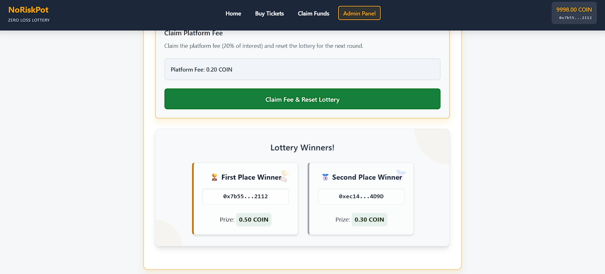
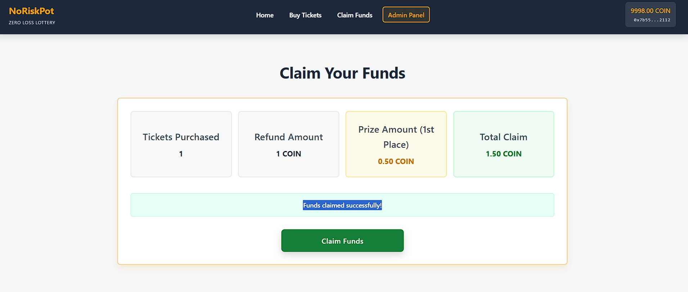

# No Risk Pot

## 🏆 Arbitrum Open House NYC: Online Buildathon

This project was submitted to the **Arbitrum Open House NYC: Online Buildathon**.

- **Submission:** [View on HackQuest](https://www.hackquest.io/projects/Arbitrum-Open-House-NYC-Online-Buildathon-No-Risk-Arbitrum-Pot)

## 🔗 Links

- **Live Website:** [Visit the live version](https://mantle-gamefi-project.vercel.app/)
- **Presentation:** [Watch the demo video](https://youtu.be/Z_vZWt1RLnk?si=veBGVh_LMBG_G88x)

## Project Overview

No Risk Pot is a revolutionary DeFi lottery platform where users can participate in lottery draws without risking their principal investment. Here's how it works:

1. Users purchase lottery tickets using COIN (a stablecoin).
2. The platform admin collects all ticket purchases and invests the pooled funds in liquidity pools or yield farming strategies to generate interest.
3. When a lottery draw occurs, winners are selected and prizes are distributed from the interest earned, not from the principal amount.
4. **Key differentiator:** All users receive their initial investment back, regardless of whether they win or lose the lottery.

### Prize Distribution

- 1st Prize: 50% of the total interest earned
- 2nd Prize: 30% of the total interest earned
- Platform Fee: 20% of the total interest earned goes to the platform owner

This creates a no-loss lottery system where participants can enjoy the excitement of potentially winning while preserving their capital.

## 🖼️ Project Screenshots

### 🏠 Home Page

**Home Page - View 1**  


**Home Page - View 2**  


**Home Page - View 3**  


### 🎟️ Buy Ticket Page

**Buy Ticket using COIN**  


### 🛠️ Admin Dashboard

**Admin Page - view-1**  


**Admin Page - view-2**  


**Admin Page - view-3**  


### 💰 Claim Fund Page

**Claim Fund Page**  


## Project Structure

```
frontend/
├── public/
│   ├── index.html
│   └── *.png (screenshots)
├── src/
│   ├── App.js
│   ├── index.js
│   ├── components/
│   │   └── NetworkError.js
│   ├── pages/
│   │   ├── Home.js
│   │   ├── BuyTickets.js
│   │   ├── AdminPanel.js
│   │   └── ClaimFunds.js
│   ├── styles/
│   │   ├── Home.css
│   │   ├── BuyTickets.css
│   │   ├── AdminPanel.css
│   │   ├── Navbar.css
│   │   └── NetworkError.css
│   └── artifacts/
│       └── addresses.json
├── package.json
├── pnpm-lock.yaml
└── README.md
```

## 🚀 How to Run

### Frontend

**Prerequisites:** Node.js 18 LTS, npm/pnpm, MetaMask (or compatible EVM wallet)

1. Navigate to frontend and install dependencies:
   ```bash
   cd frontend && npm install
   ```

2. Start the development server:
   ```bash
   npm start
   ```

3. Open http://localhost:3000 in your browser.

### Backend (Deploy Contracts)

1. Create `.env` in backend with your `PRIVATE_KEY`
2. Deploy to Arbitrum Sepolia:
   ```bash
   cd backend && npm run deploy:arbitrum-sepolia
   ```

### Network

- The dApp targets the **Arbitrum Sepolia Testnet**. If you are on another network, the app will prompt you to switch or add the network automatically.
- You may need some test COIN on Arbitrum Sepolia Testnet to perform transactions.

## 📜 Deployed Contracts (Arbitrum Sepolia Testnet)

Contracts are already deployed. You can verify them on [Arbitrum Sepolia Explorer](https://sepolia.arbiscan.io):

- Coin: `0xD07E0C3658F4517876EEb19e21E77051f1D3f9aD`
- ZeroLossLottery: `0x358Dc0acD69CD4CC89cddeD2D1cc9430d13aDc96`

> Note: The frontend reads addresses from `frontend/src/artifacts/addresses.json`.

## Security Considerations

- Always ensure your `.env` files are included in `.gitignore`
- Never commit sensitive keys or secrets to version control
- Use a dedicated development wallet with limited funds for testing
- Consider using a hardware wallet for production deployments
